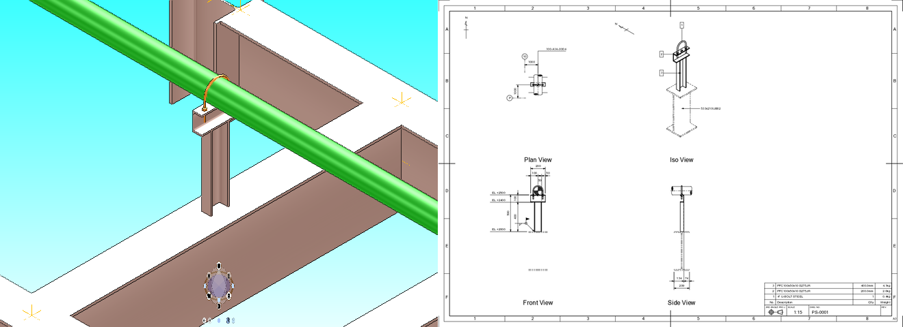

# SDS <!-- {docsify-ignore-all} -->

**SDS** is a macro for faster modeling and drawing of piping supports.

## Getting Started

- If you are a system administrator, start with [Initial Setup](initial-setup.md).
- If you are a modeling operator/designer, start with [Quick Start](quick-start.md).

## Contents

[TOC](_sidebar.md ":include")
