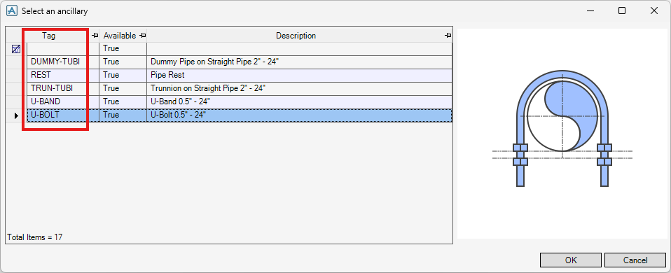
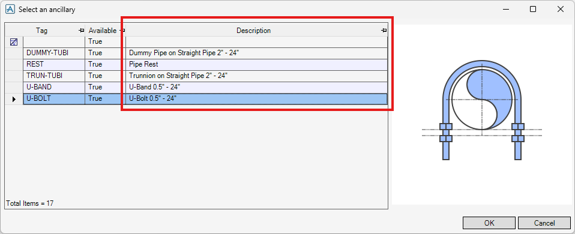
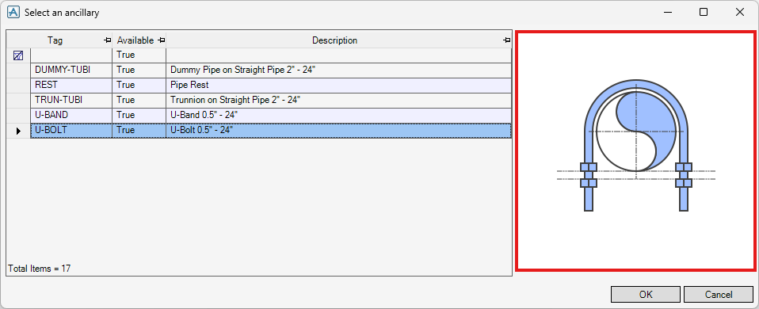
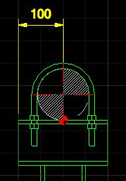
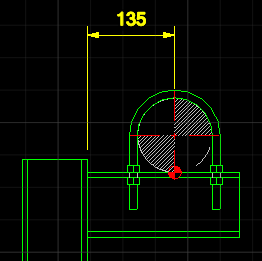
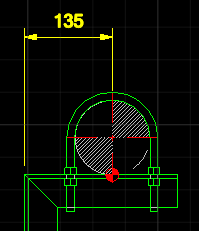
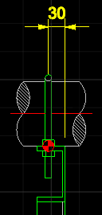

# Ancillary Data File

## Introduction

An Ancillary Data File is a JSON file that defines how SDS creates an ancillary item attached to piping. Ancillary Data Files are stored in the directories specified by [assyAnciPaths](settings.md#assyancipaths) in the Configuration File.

## Properties

### tag

A unique name for this Ancillary Data File. SDS uses this tag to identify which data file was used to create an ancillary in the model. See [assyTagAttrib](settings.md#assytagattrib) for where the tag is stored on the created element. See [assyTagPrelim](settings.md#assytagprelim) for the reserved tag value used for the preliminary ancillary.



**Example:**

```json
"tag": "U-BOLT"
```

### description

Description text shown in the ancillary selection form.



**Example:**

```json
"description": "U-Bolt 0.5\" - 24\""
```

### imgfile

Path to the image file shown in the ancillary selection form.



**Example:**

```json
"imgfile": "%pmllib%\\sds\\img\\sds_an_ubolt.png"
```

### condition

Logical expression evaluated for the picked piping component. SDS shows **Available** as `True` in the ancillary selection form when it returns true, otherwise `False`.

**Example:**

```json
"condition": "TYPE EQ 'TUBI' AND UNSET(IPAR)"
```

This means the ancillary is available when the element type is `TUBI` and the insulation is unset.

### owntype

Type of the ancillary owner element to create in the model.

**Options:**

- `SUPC` - For a general support component
- `TRUNNI` - For a trunnion support component
- `LUG` - For a lug support component
- `HANG` - For a pipe hanger

**Example:**

```json
"owntype": "SUPC"
```

### components

List of component definitions that SDS uses to build the ancillary. Each entry defines one component to create, and SDS creates the components in order.

When SDS creates an ancillary, it first creates the owner element with the type specified by `owntype`, then creates each `components` entry as one child element under the owner. SDS sets the child element’s `spref` by selecting an SPCO from the SPEC specified by `spec` that matches `gtype`, `stype`, and the bore of the picked piping component. After each child element is created, SDS runs `postCommands` (if specified).

**Properties:**

- `spec` (required) - SPEC Ref used to select the component.

- `gtype` (required) - Gtype used to select the component.

- `stype` (required) - Stype used to select the component.

- `matref` - SOLI Ref specifying the material of the component.

- `insu` - If `true`, sets the same insulation SPEC as the picked piping component to this component.

- `reduOffset` - Offset direction for bore/distance makeup reducer (`gtype` is `REDU`).

  Options:
  - `CENTRE` - No offset
  - `BOTTOM` - Bottom-flat
  - `TOP` - Top-flat

- `reduBores` - Bore size combinations for bore/distance makeup reducer (`gtype` is `REDU`).

  Properties:
  - `abore` - Arrive bore size
  - `lbore` - Leave bore size

- `postCommands` - PML commands to execute after creating the component.

**Example:**

```json
"components": [
  {
    "spec": "/SDS-ANCI",
    "gtype": "ANCI",
    "stype": "REST",
    "postCommands": [":MDSTrunNote1 'DO NOT CUT HOLE IN PIPE'"]
  },
  {
    "spec": "/SDS-ANCI",
    "gtype": "REDU",
    "stype": "MAKE",
    "insu": true,
    "reduOffset": "BOTTOM",
    "reduBores": [
      { "abore": "50mm",  "lbore": "40mm" },
      { "abore": "80mm",  "lbore": "50mm" },
      { "abore": "100mm", "lbore": "80mm" }
    ]
  },
  {
    "spec": "/SDS-ANCI",
    "gtype": "PLAT",
    "stype": "TREP",
    "matref": "/E3DSD_STEEL",
    "postCommands": ["clearance 100mm behind compref of first tranci"]
  }
]
```

### postCommands

PML commands to execute after SDS finishes creating the ancillary.

**Example:**

```json
"postCommands": ["$m\"%apsdflts%\\sds\\ancillaries\\cmds.txt\""]
```

### steelEndLengths

End lengths of steelwork touched by the ancillary, by `bore` size. Each value is the distance from the steelwork end to the pipe centre line.

**Properties:**

- `bore` - Bore size of the ancillary.

- `open` - Length for steelwork not connected to another steelwork.



- `close` - Length for steelwork connected to another steelwork.



- `angle` - Length for steelwork connected to another steelwork with an angled cut.



**Example:**

```json
"steelEndLengths": [
  { "bore": "50mm",  "open": "70mm",  "close": "100mm", "angle": "100mm" },
  { "bore": "80mm",  "open": "90mm",  "close": "125mm", "angle": "125mm" },
  { "bore": "100mm", "open": "100mm", "close": "135mm", "angle": "135mm" }
]
```

### steelBoltGauges

Bolt gauge distances for bolting ancillaries, by `spref`. Each entry specifies the distance from the steelwork justification line (Jusline) to the bolting position.



**Properties:**

- `spref` - SPCO Ref of the steelwork profile.

- `dist` - Distance from the steelwork justification line (Jusline) to the bolting position.

**Example:**

```json
"steelBoltGauges": [
  { "spref": "/BS-L50x50x6", "dist": "30mm" },
  { "spref": "/BS-L65x65x6", "dist": "35mm" },
  { "spref": "/BS-L75x75x9", "dist": "40mm" }
]
```

### steelTouchedCmds

PML commands to execute when the ancillary touches any steelwork.

When SDS runs these commands, it assigns the reference of the touched steelwork (a GENSEC or SCTN element) to `!!SDSTOUCHEDSCTN`. You can use this variable in your commands to access the touched steelwork.

**Example:**

```json
"steelTouchedCmds": ["!!ce.mem[1].desp[1] = !!SDSTOUCHEDSCTN.rpro.ftka"]
```
