# Draw Option File

## Introduction

A Draw Option File is a JSON file that defines how SDS generates support drawings. In the **SDS Draw** form, each support is assigned an option file in the list. When you generate or update a support drawing, SDS loads the option file assigned to that support and applies its settings.

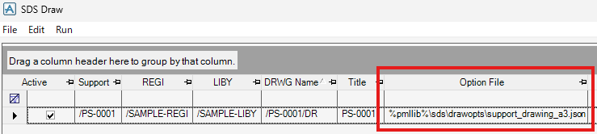

## Properties

### templateDrwg

Template DRWG Ref. When SDS generates a support drawing from scratch or regenerates one, SDS copies the DRWG specified by this value and uses it as the drawing template.

**Example:**

```json
"templateDrwg": "/FES/DRA/PRJ/TMP/SUPPO/A3"
```

### plotStyle

PLTSTY Ref used when exporting a support drawing to PDF. SDS uses this plot style for PDF output.

**Example:**

```json
"plotStyle": "/FES-Monochrome"
```

### drawProcedures

PML command list used to generate or update a support drawing. SDS runs the commands **from top to bottom**.

Before running the list, SDS sets `!!SDSDRAWER` for the current SUPPO element. You can customize the workflow with your own PML commands, or simply call the built-in methods in order.

**Available methods:**

- `.ClearLayers(!vorder is STRING)` - Clear layers for dimension and label elements.
- `.UpdateViews()` - Update all the views.
- `.DrawMtoTable()` - Draw the MTO table.
- `.DrawItemLabels(!vorder is STRING)` - Draw item labels and remote-spread them.
- `.DrawGeneralSymbols(!vorder is STRING)` - Draw pipe end/break symbols and the origin symbol.
- `.DrawRefDimensions(!vorder is STRING)` - Draw reference dimensions to the nearest grid.
- `.DrawPipeNames(!vorder is STRING)` - Draw labels for supported pipe names.
- `.DrawWeldSymbols(!vorder is STRING)` - Draw weld symbols.
- `.DrawDimensions(!vorder is STRING)` - Draw dimensions.
- `.DrawDetailOlays()` - Draw detail views.

> [!NOTE]
> For methods with `!vorder`, pass `ALL` or a space-separated list of looking values to choose the target VIEW elements and their processing order.
> `ALL` uses the same order as the entries in `viewDefs`.

**Example:**

```json
"drawProcedures": [
  "!!SDSDRAWER.ClearLayers('ALL')",
  "!!SDSDRAWER.UpdateViews()",
  "!!SDSDRAWER.DrawMtoTable()",
  "!!SDSDRAWER.DrawGeneralSymbols('ALL')",
  "!!SDSDRAWER.DrawWeldSymbols('FRONT RSIDE PLAN')",
  "!!SDSDRAWER.DrawDimensions('FRONT RSIDE PLAN')",
  "!!SDSDRAWER.DrawRefDimensions('PLAN')",
  "!!SDSDRAWER.DrawPipeNames('PLAN RSIDE FRONT')",
  "!!SDSDRAWER.DrawItemLabels('ISO3')",
  "!!SDSDRAWER.DrawDetailOlays()"
]
```

### mtoNoteName

Name pattern used to find the NOTE element to create the MTO table.

**Example:**

```json
"mtoNoteName": "*/MTO"
```

### mtoSheetPos

XY Position of the origin corner of the MTO table on the sheet.


> [!NOTE]
> If [mtoUpToDown](#mtouptodown) is true, the origin corner is **top-left** instead of bottom-left.

**Example:**

```json
"mtoSheetPos": "300mm 20mm"
```

### mtoUpToDown

If true, SDS draws the MTO table from top to bottom.

**Example:**

```json
"mtoUpToDown": false
```

**Options:**

- `false` - Bottom to top

  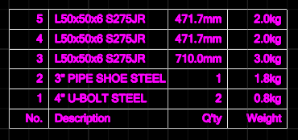

- `true` - Top to bottom

  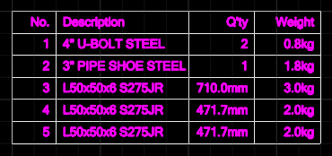

### mtoDivisionNum

Number of columns to split the MTO table into.

**Example:**

```json
"mtoDivisionNum": 2
```

Result:

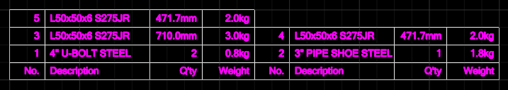

### mtoColumnDefs

Column definitions for the MTO table. Each entry defines one column, and the entries are applied from left to right.

**Properties:**

- `header` - Text shown in the table header.

- `align` - Text alignment in the column.

  Options:
  - `L` - Left
  - `C` - Center
  - `R` - Right

- `width` - Column width on the sheet.

- `value` - Which MTO item field to show in the column.

  Options:
  - `number` - Part No.
  - `desc` - Description
  - `qty` - Quantity
  - `pcs` - Quantity (pcs)
  - `length` - Quantity (length)
  - `weight` - Weight

**Example:**

```json
"mtoColumnDefs": [
  { "header": "No.",         "align": "C", "width": "10mm", "value": "number" },
  { "header": "Description", "align": "L", "width": "35mm", "value": "desc"   },
  { "header": "Q'ty",        "align": "R", "width": "20mm", "value": "qty"    },
  { "header": "Weight",      "align": "R", "width": "15mm", "value": "weight" }
]
```

Result:

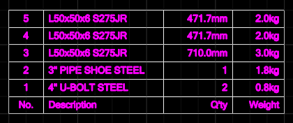

### viewFixNorth

If true, the front view is oriented to the north. If false, SDS automatically determines the front view direction.

> [!NOTE]
> If the support model is placed diagonally to north, SDS ignores this setting and automatically determines the front view direction.

**Example:**

```json
"viewFixNorth": true
```

### touchLabelTexts

Label definitions for elements touching the support. For each touched element, SDS evaluates the entries in order and uses the `expression` from the **first** entry whose `condition` is true. If no entry matches, no label is generated.

**Properties:**

- `condition` - Logical expression evaluated for the touched element.
- `expression` - PML expression that generates the label text for the touched element.

**Example:**

```json
"touchLabelTexts": [
  {
    "condition": "TYPE INSET('GENSEC','SCTN')",
    "expression": "DESC OF CATR"
  },
  {
    "condition": "TRUE",
    "expression": "AFTER(FULLNAME,'/')"
  }
]
```

In this example, a touched `GENSEC` or `SCTN` element is labeled with `DESC OF CATR`. All other touched elements use the fallback entry (`condition`: `TRUE`) and are labeled with `AFTER(FULLNAME,'/')`.

### defaultViewDef

Default settings applied to all VIEW elements. SDS starts from this definition when configuring each VIEW, then applies any matching VIEW-specific overrides selected by the VIEW element name. See [View Definition](#view-definition) for details.

### viewDefs

VIEW-specific override definitions. SDS applies an entry when its `name` pattern matches the VIEW element name. See [View Definition](#view-definition) for details.

**Example:**

```json
"viewDefs": [
  {
    "name": "*/PLAN",
    "looking": "PLAN"
  },
  {
    "name": "*/FRONT",
    "looking": "FRONT"
  },
  {
    "name": "*/SIDE",
    "looking": "RSIDE"
  },
  {
    "name": "*/ISO",
    "looking": "ISO3",
    "scales": "AUTO"
  }
]
```

### detailsOlayName

OLAY name suffix used for detail views.

**Example:**

```json
"detailsOlayName": "DETAIL"
```

### detailsXYScale

XYScale applied to OLAY elements (X and Y scale factors).

**Example:**

```json
"detailsXYScale": "1.0 1.0"
```

### detailsSheetPos

XY positions on the sheet for detail views. SDS assigns these positions in the order the OLAY elements are created.

> [!NOTE]
> If the number of OLAY elements exceeds the number of entries in `detailsSheetPos`, SDS raises an error.

**Example:**

```json
"detailsSheetPos": ["150mm 200mm", "150mm 150mm", "150mm 100mm"]
```

### detailsItems

Definitions for detail views generated from MTO items. For each MTO item, SDS checks the entries in order and creates detail views as OLAY elements for entries whose `condition` is true.

If `overref` or `plotfile` is set, SDS uses it. If neither is set, SDS creates an OVER and uses `viewdir`, `title`, `dimxpos`, and `dimypos`. If **both** `dimxpos` and `dimypos` are omitted, SDS generates the dimensions automatically.

**Properties:**

- `condition` - Logical expression that the MTO item must satisfy to generate a detail view.
- `overref` - OVER Ref shown on the detail view.
- `plotfile` - File path to a plot file shown on the detail view.
- `viewdir` - Looking direction used when SDS creates an OVER automatically. (Default: `-Z WRT CE`)
- `title` - Title used when SDS creates an OVER automatically. (Default: `DETAIL`)
- `dimxpos` - Dimension line positions along the X direction used when SDS creates an OVER automatically.
- `dimypos` - Dimension line positions along the Y direction used when SDS creates an OVER automatically.

**Example:**

```json
"detailsItems": [
  {
    "condition": "TYPE EQ 'FIXING' AND GTYPE OF CATR EQ 'RIBP'",
    "viewdir": "-Z WRT CE",
    "title": "RIBPLATE DETAIL",
    "dimxpos": ["P4POS", "P3POS", "P2POS"],
    "dimypos": ["P1POS", "P2POS", "P3POS"]
  },
  {
    "condition": "TYPE EQ 'FIXING' AND GTYPE OF CATR EQ 'PLAT'",
    "viewdir": "-Z WRT CE",
    "title": "PLATE DETAIL"
  }
]
```

### detailsTempOver

Template OVER Ref used when SDS creates an OVER automatically for a detail view (OLAY element).

**Example:**

```json
"detailsTempOver": "/FES-SUPPO-DETAIL"
```

### detailsViewDef

View definition applied to the VIEW elements under the OVER that SDS creates automatically for detail views. See [View Definition](#view-definition) for details.

**Example:**

```json
"detailsViewDef": {
  "name": "*/VIEW",
  "maxSize": "30mm 30mm",
  "padding": "10mm"
}
```

## View Definition

The view definition for configuring a VIEW element in a support drawing.

**Properties:**

### name

Name pattern for the VIEW element name.

**Example:**

```json
"name": "*/PLAN"
```

### looking

Looking direction preset for the VIEW element.

**Example:**

```json
"looking": "PLAN"
```

**Options:**

- `PLAN` - Plan view
- `FRONT` - Front view
- `RSIDE` - Right-side view
- `LSIDE` - Left-side view
- `ISO1` - Isometric view (N is bottom-right)
- `ISO2` - Isometric view (N is top-right)
- `ISO3` - Isometric view (N is top-left)
- `ISO4` - Isometric view (N is bottom-left)

### scales

Space-separated list of candidate scales for the VIEW element. SDS tries the scales from left to right and uses the first one that fits within `maxSize`.

> [!NOTE]
> If the value is set to `AUTO`, SDS calculates a fitting scale instead of choosing from the list.

**Example:**

```json
"scales": "1:1 1:2 1:5 1:10 1:15 1:20 1:25 1:50"
```

### maxSize

Maximum view size on the sheet (width and height).

**Example:**

```json
"maxSize": "100mm 100mm"
```

### padding

Padding applied to the support model bounding box in all directions when fitting it into the view.

**Example:**

```json
"padding": "25mm"
```

### nArrowPrefix

Name prefix of the SYTM element used as the north arrow symbol. SDS appends one of `PLAN`, `ISO1`, `ISO2`, `ISO3`, or `ISO4` to this prefix based on the VIEW direction, and uses the resulting SYTM name.

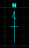 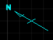

**Example:**

```json
"nArrowPrefix": "/FES-NORTH-ARROW-"
```

This means SDS uses `/FES-NORTH-ARROW-PLAN`, `/FES-NORTH-ARROW-ISO1`, `/FES-NORTH-ARROW-ISO2`, `/FES-NORTH-ARROW-ISO3`, or `/FES-NORTH-ARROW-ISO4` as the SYTM element name.

### dimLayerPurp

Purpose pattern used to find the LAYE for dimension elements. SDS uses the first LAYE whose Purpose matches this value, then creates dimension elements under that LAYE.

**Example:**

```json
"dimLayerPurp": "DIM*"
```

### dimStyle

DMSTYL Ref used for dimension elements created by SDS.

**Example:**

```json
"dimStyle": "/FES-DIM-BLACK"
```

### dimStaggered

If true, SDS staggers the dimension texts (alternating their positions).

**Example:**

```json
"dimStaggered": true
```

**Options:**

- `false` - Dimension texts are not staggered

  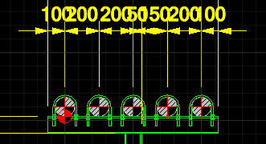

- `true` - Dimension texts are staggered

  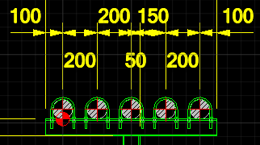

### dimPltxtLevel

LDIM Pltxt value used to indicate elevation on the projection line of vertical dimensions.

**Example:**

```json
"dimPltxtLevel": "EL #POSU+<WRT /*>"
```

Result:

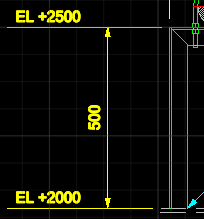

### labLayerPurp

Purpose pattern used to find the LAYE for label elements. SDS uses the first LAYE whose Purpose matches this value, then creates label elements under that LAYE.

**Example:**

```json
"labLayerPurp": "LAB*"
```

### labStyle

LBSTYL Ref used for label elements created by SDS.

**Example:**

```json
"labStyle": "/FES-LABEL-BLACK"
```

### labOrigin

SYTM Ref used as the origin marker for the support origin.

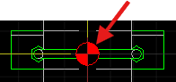

**Example:**

```json
"labOrigin": "/FES-ORIGIN-MARKER"
```

### labGrid

SYTM Ref used as the grid ID balloon symbol.

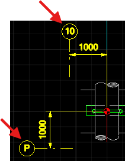

**Example:**

```json
"labGrid": "/FES-GRID-ID"
```

### labPipeName

SYTM Ref used as the label for the supported PIPE name.

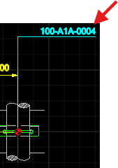

**Example:**

```json
"labPipeName": "/FES-PIPE-NAME"
```

### labPipeEnd

SYTM Ref used as the pipe end (cross-section) symbol when the piping is in front of the VIEW.

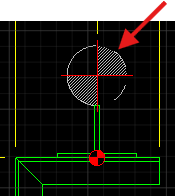

**Example:**

```json
"labPipeEnd": "/FES-PIPE-END"
```

### labPipeBreak

SYTM Ref used as the pipe break symbol when the piping is clipped at the VIEW boundary.

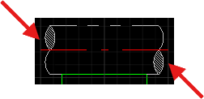

**Example:**

```json
"labPipeBreak": "/FES-PIPE-BREAK"
```

### labWeldLeft

SYTM Ref used as the left-leader weld symbol.

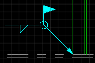

**Example:**

```json
"labWeldLeft": "/FES-FIELD-WELD-L"
```

### labWeldRight

SYTM Ref used as the right-leader weld symbol.

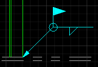

**Example:**

```json
"labWeldRight": "/FES-FIELD-WELD-R"
```

### labHoleCLines

SYTM Ref used as the hole centerline (crosshair) symbol.

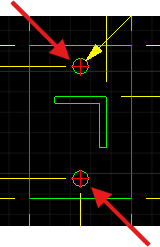

**Example:**

```json
"labHoleCLines": "/FES-CROSS-HAIRS"
```

### rRules

Representation rule definitions for a VIEW. SDS creates one RRUL element under the VIEW for each entry in `rRules`, then sets `style` and `criteria`.

**Properties:**

- `style` - STYL Ref applied by the representation rule.
- `criteria` - PML expression that selects elements to which the representation rule applies.

> [!NOTE]
> In `criteria`, `$!<SUPPO>` is automatically replaced with the name of the target SUPPO element.

**Example:**

```json
"rRules": [
  {
    "style": "/FES/DRA/PRJ/STYL/GEN/SUPPO/SUPPO",
    "criteria": "$!<SUPPO>"
  },
  {
    "style": "/FES/DRA/PRJ/STYL/GEN/SUPPO/PIPE",
    "criteria": "ALL PIPE"
  },
  {
    "style": "/FES/DRA/PRJ/STYL/GEN/SUPPO/OTHERS",
    "criteria": "ALL"
  }
]
```
