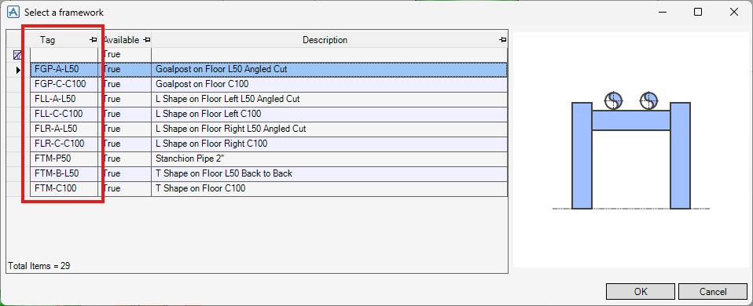
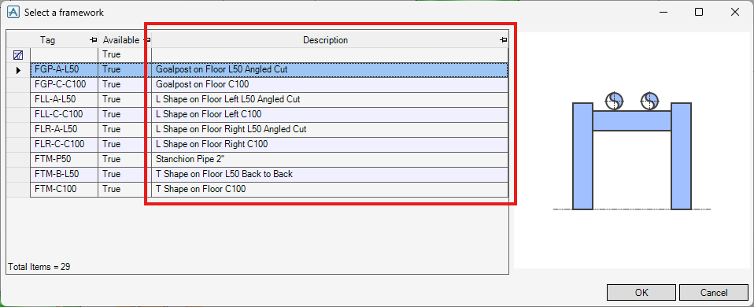
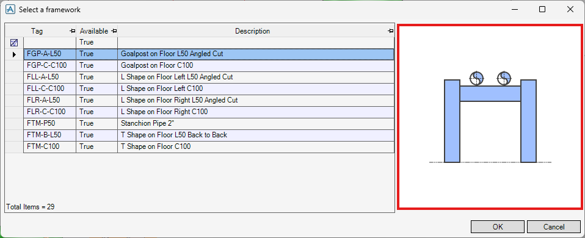
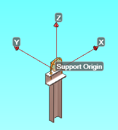

# Framework Data File

## Introduction

A Framework Data File is a JSON file that defines how SDS creates a support framework. Framework Data Files are stored in the directories specified by [assyFrmwPaths](settings.md#assyfrmwpaths) in the Configuration File.

## Properties

### tag

A unique name for this Framework Data File. SDS uses this tag to identify which data file was used to create a framework in the model. See [assyTagAttrib](settings.md#assytagattrib) for where the tag is stored on the created element.



**Example:**

```json
"tag": "FGP-A-L50"
```

### description

Description text shown in the framework selection form.



**Example:**

```json
"description": "Goalpost on Floor L50 Angled Cut"
```

### imgfile

Path to the image file shown in the framework selection form.



**Example:**

```json
"imgfile": "%pmllib%\\sds\\img\\sds_fr_floor_goalpost.png"
```

### pickFor

The direction from the support origin toward the surface where the framework will be attached. If the picked direction does not match `pickFor`, SDS sets **Available** to `False` in the framework selection form.

**Options:**

- `DOWN` - Floor (down from the origin)
- `UP` - Ceiling (up from the origin)
- `LEFT` - Wall on the left side of the origin
- `RIGHT` - Wall on the right side of the origin
- `FRONT` - Wall in front of the origin
- `BACK` - Wall behind the origin

**Example:**

```json
"pickFor": "DOWN"
```

### vertical

Whether this framework is intended for vertical piping. If the supported pipe orientation does not match `vertical`, SDS sets **Available** to `False` in the framework selection form.

**Options:**

- `false` - For **horizontal** piping
- `true` - For **vertical** piping

**Example:**

```json
"vertical": false
```

### minBore

The minimum bore size of an ancillary that can be attached to this framework. If any supported ancillary has a bore smaller than `minBore`, SDS sets **Available** to `False` in the framework selection form.

**Example:**

```json
"minBore": "15mm"
```

### maxBore

The maximum bore size of an ancillary that can be attached to the framework. If any supported ancillary has a bore larger than `maxBore`, SDS sets **Available** to `False` in the framework selection form.

**Example:**

```json
"maxBore": "600mm"
```

### endPrepLeft

End preparation type for the left end of the bar section. SDS uses this setting when it looks up [steelEndLengths](ancillary.md#steelendlengths) in the Ancillary Data File.

**Options:**

- `OPEN` - End is not connected to another steelwork section.
- `CLOSE` - End is connected to another steelwork section.
- `ANGLE` - End is connected to another steelwork section with an angled cut.

**Example:**

```json
"endPrepLeft": "CLOSE"
```

### endPrepRight

Same as [endPrepLeft](#endprepleft), but for the right end of the bar section.

**Example:**

```json
"endPrepRight": "CLOSE"
```

### endExtendOffset

Extra offset applied when SDS auto-extends the bar end to reach the picked attachment position. Use a negative value to shorten the auto-extended length.

**Example:**

```json
"endExtendOffset": "25mm"
```

### bar

Definition of the bar section on which ancillaries are placed. See [Section Definition](#section-definition) for details.

**Example:**

```json
"bar": {
  "suffix": "BAR",
  "spref": "/BS-PFC100x50x10",
  "matref": "/E3DSD_S275JR",
  "jusline": "LBOT",
  "lmirror": false,
  "ydir": "D WRT OWN"
}
```

### legs

Definitions of the leg sections. Any properties omitted in a leg entry inherit values from `bar`. See [Section Definition](#section-definition) for details.

**Example:**

```json
"legs": [
  {
    "suffix": "LEG-L",
    "side": "LEFT",
    "lmirror": false,
    "ydir": "W WRT OWN",
    "zdir": "D WRT OWN",
    "xoffset": "0mm",
    "zoffset": "20mm"
  },
  {
    "suffix": "LEG-R",
    "side": "RIGHT",
    "lmirror": true,
    "ydir": "E WRT OWN",
    "zdir": "D WRT OWN",
    "xoffset": "0mm",
    "zoffset": "20mm"
  }
]
```

### postCommands

PML commands to execute after SDS finishes creating the framework.

**Example:**

```json
"postCommands": ["$m\"%apsdflts%\\sds\\frameworks\\cmds.txt\""]
```

## Section Definition

The steelwork section definition.

**Properties:**

### suffix

Suffix appended to the parent element name to form the GENSEC name.

**Example:**

```json
"suffix": "BAR"
```

This means SDS names the GENSEC as `<SUPPO Name>/STRU-BAR`.

### side

(Leg only) Specifies which side of the bar section the leg section connects to.

**Options:**

- `LEFT` - Connects to the left side of the bar section.
- `RIGHT` - Connects to the right side of the bar section.
- `MID` - Connects to the midpoint of the bar section.

**Example:**

```json
"side": "LEFT"
```

### spref (Section)

SPCO Ref specifying the steel profile for this GENSEC.

**Example:**

```json
"spref": "/BS-PFC100x50x10"
```

### matref (Section)

SOLI Ref specifying the material for this GENSEC.

**Example:**

```json
"matref": "/E3DSD_S275JR"
```

### shop (Section)

Shop/Site flag for this GENSEC. This flag affects where the field weld symbol is placed on the support drawing.

**Example:**

```json
"shop": false
```

### jusline

P-Line name used as the justification line for this GENSEC.

**Example:**

```json
"jusline": "LBOT"
```

### memline

P-Line name used as the member line for this GENSEC.

**Example:**

```json
"memline": "CMID"
```

### lmirror

Whether the GENSEC is created as a mirrored shape.

**Example:**

```json
"lmirror": false
```

### ydir

Y direction for the SPINE of this GENSEC. Changing `ydir` rotates the GENSEC orientation.

**Example:**

```json
"ydir": "W WRT OWN"
```

### zdir

(Leg only) Direction along which the leg section runs.

**Example:**

```json
"zdir": "D WRT OWN"
```

### xoffset

(Leg only) X offset from the GENSEC start position.

> [!TIP]
> The X/Y/Z directions match the axis arrows shown in the 3D view while the **SDS Support Editor** form is open.
>
> 

**Example:**

```json
"xoffset": "25mm"
```

### yoffset

(Leg only) Y offset from the GENSEC start position.

**Example:**

```json
"yoffset": "-25mm"
```

### zoffset

(Leg only) Z offset from the GENSEC start position.

**Example:**

```json
"zoffset": "20mm"
```

### postCommands (Section)

PML commands to execute after creating the GENSEC.

**Example:**

```json
"postCommands": ["!!ce.desp[1] = 50"]
```

### startJoints

Definitions of FIXING joints connected to the start of the section. See [Joint Definition](#joint-definition) for details.

SDS applies the same logic as [endJoints](#endjoints).

**Example:**

```json
"startJoints": [
  {
    "spref": "/SDS-JOIN/SDS-TP-WELD-P50",
    "matref": "/E3DSD_S275JR",
    "orientation": "Y is N WRT OWN and Z is D WRT OWN",
    "cutback": "RPRO PTHK"
  }
]
```

### endJoints

Definitions of FIXING joints connected to the end of the section. See [Joint Definition](#joint-definition) for details.

SDS checks entries from top to bottom and uses the **first** entry whose `condition` matches the picked attachment element. If `condition` is omitted, it is treated as always `true` (use this as a fallback entry). SDS then creates that FIXING joint at the section end.

**Example:**

```json
"endJoints": [
  {
    "condition": "PURP OF ZONE eq 'CIV'",
    "spref": "/SDS-JOIN/SDS-BP-BOLT2X-C100",
    "matref": "/E3DSD_S275JR",
    "shop": false,
    "orientation": "Y is E WRT OWN and Z is U WRT OWN",
    "cutback": "RPRO PTHK",
    "members": [
      {
        "spref": "/SDS-JOIN/SDS-BOLT-ANCHOR-M12",
        "position": "P5POS",
        "orientation": "Z is P5DIR"
      },
      {
        "spref": "/SDS-JOIN/SDS-BOLT-ANCHOR-M12",
        "position": "P6POS",
        "orientation": "Z is P6DIR"
      }
    ]
  },
  {
    "spref": "/SDS-JOIN/SDS-BP-WELD-C100",
    "matref": "/E3DSD_S275JR",
    "orientation": "Y is E WRT OWN and Z is U WRT OWN",
    "cutback": "RPRO PTHK"
  }
]
```

## Joint Definition

Definition of a FIXING joint.

**Properties:**

### condition

Logical expression that the picked attachment element must satisfy for this joint to be created. If `condition` is omitted, it is always `true`.

**Example:**

```json
"condition": "PURP OF ZONE eq 'CIV'"
```

This means SDS creates this joint only when the picked element is under a ZONE whose `PURP` is `CIV`.

### spref (Joint)

SPCO Ref specifying the joint catalog for this FIXING.

**Example:**

```json
"spref": "/SDS-JOIN/SDS-BP-BOLT2X-C100"
```

### matref (Joint)

SOLI Ref specifying the material for this FIXING.

**Example:**

```json
"matref": "/E3DSD_S275JR"
```

### shop (Joint)

Shop/Site flag for this FIXING. This flag affects where the field weld symbol is placed on the support drawing.

**Example:**

```json
"shop": false
```

### orientation

Orientation applied to this FIXING.

**Example:**

```json
"orientation": "Y is N WRT OWN and Z is D WRT OWN"
```

### cutback

Amount by which the attached section end is shortened to allow for the joint.

**Example:**

```json
"cutback": "RPRO PTHK"
```

### postCommands (Joint)

PML commands to execute after creating the FIXING.

**Example:**

```json
"postCommands": ["BY U 50mm"]
```

### members

Definitions of member FIXING elements created as part of this joint. Each entry describes one member FIXING and how it is placed and oriented.

**Properties:**

- `spref` - SPCO Ref specifying the member joint catalog for this FIXING.
- `matref` - SOLI Ref specifying the material for this FIXING.
- `position` - Position for this FIXING.
- `orientation` - Orientation for this FIXING.
