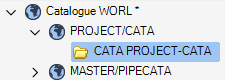
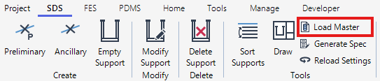
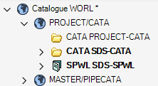
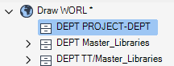
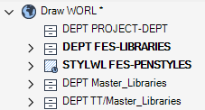

# Initial Setup

## Prepare Sample Catalog

To prepare the sample catalog for your project, follow these steps:

1. Open the **Paragon** module.

2. Set the CE to a top-level element so that the sample CATA and SPWL will be created immediately after it.

   

3. On the **SDS** tab, click **Load Master**.

   

4. In the confirmation dialog, click **Yes**.

   

5. Make sure that _/SDS-CATA_ and _/SDS-SPWL_ have been created.

   

## Prepare Drawing Template Library

To prepare the sample drawing template library for your project, follow these steps:

1. Open the **Draw** module.

2. Set the CE to a top-level element so that the sample DEPT and STYLWL will be created immediately after it.

   

3. On the **SDS** tab, click **Load Master**.

   

4. In the confirmation dialog, click **Yes**.

   

5. Make sure that _/FES-LIBRARIES_ and _/FES-PENSTYLES_ have been created.

   
