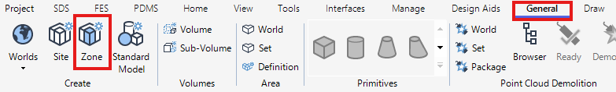
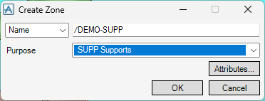
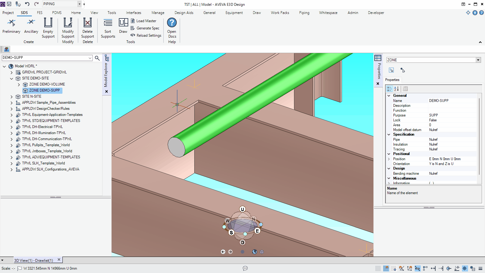
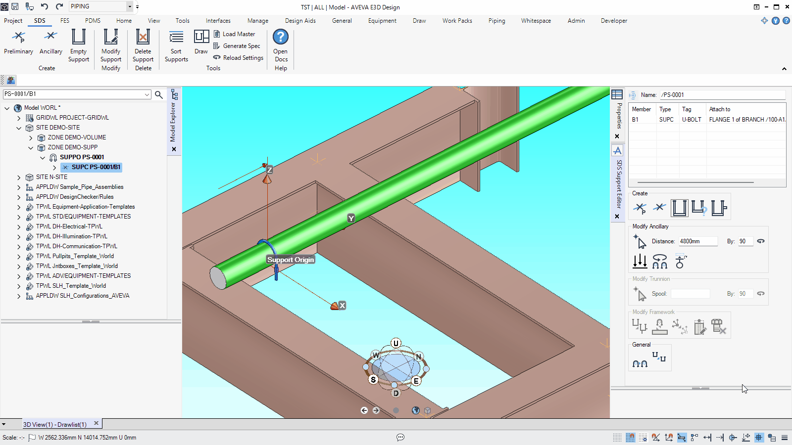
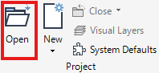
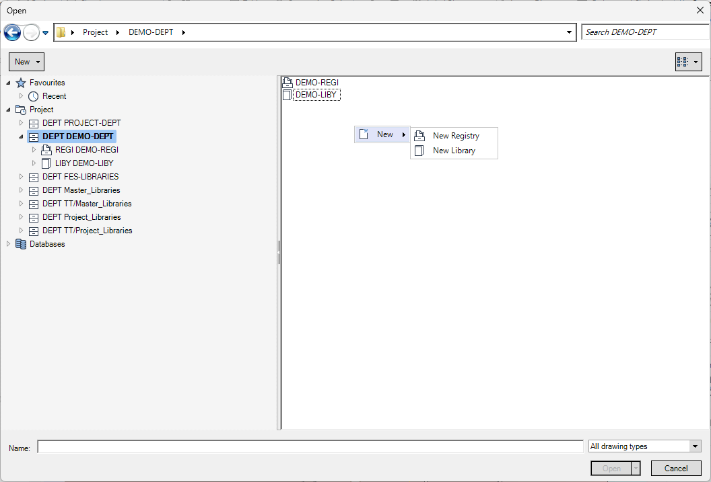
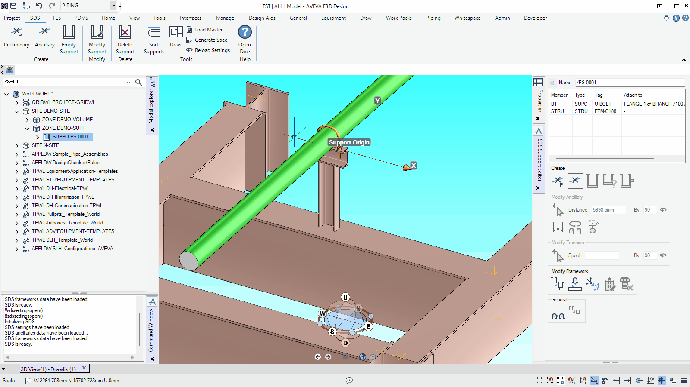

# Quick Start

## Modeling Support

### Create Support ZONE

First, you must create at least one ZONE with the purpose set to `SUPP` to store SUPPO elements. To create a ZONE, follow these steps:

1. On the **General** tab, click **Zone**.

   

2. Enter the ZONE name, set the purpose to `SUPP`, and then click **OK**.

   

### Create a New Support with Ancillary

To create a new SUPPO element, follow these steps:

1. On the **SDS** tab, click **Ancillary**.
2. In the dialog that opens, choose an ancillary type, and then click **OK**.

> [!TIP] The first time you use an SDS function after launching E3D Design, SDS takes time to load.

### Create Support Framework

To create a support framework, follow these steps:

1. In the **SDS Support Editor** form, click  **Add Framework**.
2. In the graphical view, pick the position where the support will be fixed.
3. In the dialog that opens, choose a framework type, and then click **OK**.

## Drawing Support

### Create REGI & LIBY

To store DRWG elements for support drawings and OVER elements for detail views, create a REGI element and a LIBY element. Follow these steps:

1. Open the **Draw** module or open the **Design** module with **Draw functionality in Model** enabled.

   > [!TIP] For further information about **Draw functionality in Model**, refer to the [article](https://docs.aveva.com/bundle/e3d-design/page/1048435.html) in AVEVA Documentation.

2. On the **Home** or **Draw** tab, click **Open**.

   

3. Select a DEPT, and then create a REGI element and a LIBY element from the right-click menu.

   

### Generate Support Drawings

To generate support drawings from the support models, follow these steps:

1. On the **SDS** tab, click **Draw**.
2. In the form menu, click **Edit** > **Add All Supports in MDB**.
3. In the list, enter the REGI name in the **REGI** column and the LIBY name in the **LIBY** column.
4. In the form menu, Click **Run** > **Batch Update Drawings**.
5. In the confirmation dialog, click **Yes**.
6. Check that the drawings were generated successfully.
