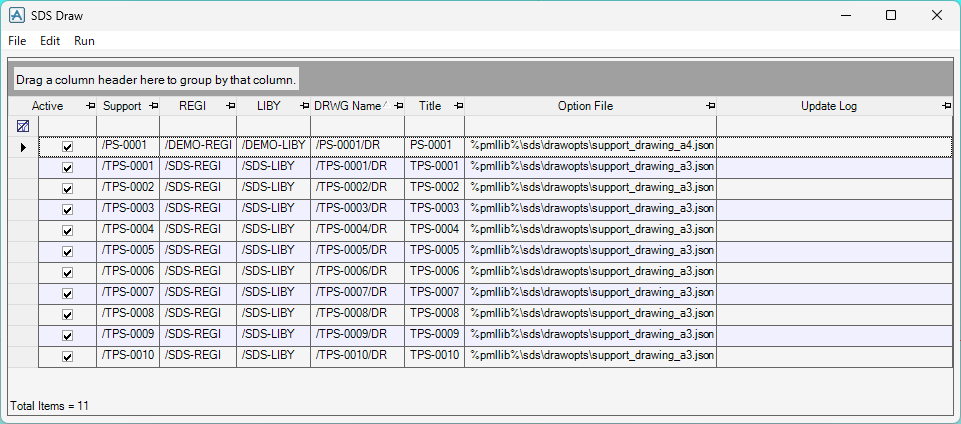
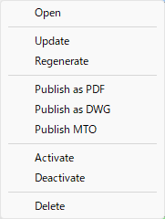
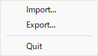
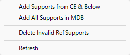
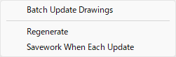

# Draw Form

The **SDS Draw** form generates support detail drawings.

## Context Menu

Right-click on the list to open the context menu.

### Open

Opens the selected drawings.

### Update

Updates (or generates) the selected drawings by running the commands listed in [drawProcedures](drawopt.md#drawprocedures) in the Draw Option File.

### Regenerate

If a drawing already exists, deletes it first, then regenerates the selected drawings.

### Publish as PDF

Exports the selected drawings as PDF files to the folder specified by [drawPublishPath](settings.md#drawpublishpath) in the Configuration File.

### Publish as DWG

Exports the selected drawings as DWG files to the folder specified by [drawPublishPath](settings.md#drawpublishpath) in the Configuration File.

### Publish MTO

Exports an MTO table as a CSV file for the selected supports to the folder specified by [drawPublishPath](settings.md#drawpublishpath) in the Configuration File.

### Activate

Selects the **Active** checkbox for the selected rows.

### Deactivate

Clears the **Active** checkbox for the selected rows.

### Delete

Deletes the selected rows.

## File

### Import

Imports data from an Excel (.xlsx) file into the list.

### Export

Exports the list to an Excel (.xlsx) file.

### Quit

Closes the form.

## Edit

### Add Supports from CE & Below

Adds rows for all SUPPO elements under CE.

### Add All Supports in MDB

Adds rows for all SUPPO elements in the current MDB.

### Delete Invalid Ref Supports

Deletes all rows with an invalid reference in the **Support** column.

### Refresh

Refreshes the list.

## Run

### Batch Update Drawings

Updates all drawings whose **Active** checkbox is checked in the list. Continues processing the remaining drawings even if an error occurs.

### Regenerate (Toggle)

When checked, deletes any existing drawing before updating it during a batch update.

### Savework When Each Update (Toggle)

When checked, automatically saveswork after each drawing is updated during a batch update.
