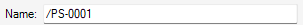
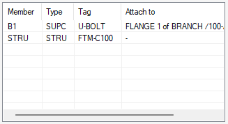
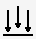
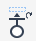
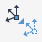

# Support Editor Form

The **SDS Support Editor** form provides tools to edit the target SUPPO element.

## Track CE

When this toggle is enabled, the form tracks CE: whenever CE changes, if CE is SUPPO or within SUPPO, that SUPPO becomes the target.

## Name

Shows the name of the target SUPPO. Edit it to rename the target SUPPO.

## Members

Lists the member elements of the target SUPPO. Right-click this list to open the context menu:

- **Reselect...**: Select another tag for the selected element.
- **Delete**: Delete the selected element.

## Create

### Add Preliminary

Creates a preliminary ancillary attached to the piping component you pick.

### Add Ancillary

Creates an ancillary attached to the piping component you pick.

### Add Framework

Creates a framework attached at the position you pick.

### Add Framework Without Pick

Creates a framework without picking a position.

### Add Special Framework

Creates an empty framework for a special shape.

## Modify Ancillary

### Position Through a Cursor Pick (Ancillary)

Prompts you to pick a position in the 3D view, then moves the current ancillary along its direction until it intersects the reference plane through the picked position.

### Distance (Ancillary)

Shows the distance from the previous piping component or ancillary to the current ancillary. Edit it to move the current ancillary from the previous component/ancillary towards the leave direction by the entered distance.

### Rotate Ancillary

Click the rotate icon to rotate the current ancillary about the axis aligned with its direction by the angle (in degrees) entered in the **By** box.

### Align Ancillary Positions

Moves all other ancillaries in the target SUPPO whose directions are parallel to the current ancillary direction. They are moved along their directions until they intersect the reference plane through the current ancillary position, perpendicular to the current ancillary direction.

### Align Ancillary Directions

Rotates all other ancillaries in the target SUPPO whose directions are parallel to the current ancillary direction so that their directions become the same as the current ancillary direction.

### Recover Bad Compref Ancillaries

Recovers ancillaries in the target SUPPO whose compref attributes contain invalid references. For each ancillary, SDS finds the piping component it contacts and sets that component as the new compref.

## Modify Trunnion

### Position Through a Cursor Pick (Trunnion Component)

Prompts you to pick a position in the 3D view, then moves the current trunnion component until it touches the reference plane through the picked position, perpendicular to the trunnion direction.

### Spool (Trunnion Component)

Shows the arrive tube length of the current trunnion component. Edit it to move the current trunnion component so that the arrive tube length becomes the entered value.

### Rotate Trunnion Component

Click the rotate icon to rotate the current trunnion component about the axis aligned with the trunnion direction by the angle (in degrees) entered in the **By** box.

## Modify Framework

### Convert to Special

Converts the current framework from a Framework Data File to Special so you can edit it manually.

### Reset Origin

Moves the current framework back to its default origin position.

### Set Origin to a Cursor Pick

Prompts you to pick a position in the 3D view, then sets the STRU element position value of the current framework to the picked position. This updates only the stored origin value; it does not move the framework in the model.

### Extend Section to a Cursor Pick

Prompts you to pick a position in the 3D view, then extends the current steelwork section to the picked position. It also creates the joint FIXING element defined in the Framework Data File for the current framework tag when the element at the picked position satisfies the [condition](framework.md#condition) in the joint definitions.

> [!TIP]
> If you pick an ancillary, the steelwork section is extended beyond the picked position by the length specified by [steelEndLengths](ancillary.md#steelendlengths) in the Ancillary Data File.

### Delete Joint Fixing

Deletes the current joint FIXING element.

## General

### Merge 2 Supports

Prompts you to pick a SUPPO element in the 3D view, then includes all member elements of the picked SUPPO as members of the target SUPPO.

### Copy Framework from Another Support

Prompts you to pick a SUPPO element in the 3D view, then copies the framework from the picked SUPPO to the target SUPPO.
