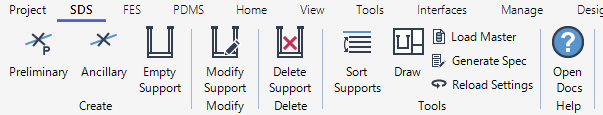

# SDS Menu Tab

The **SDS** tab in the ribbon menu provides access to general SDS functions.

## Create

> [!TIP]
> The name of the new SUPPO is assigned automatically based on the naming rules of the existing SUPPO elements in the ZONE.

### Preliminary

Creates a new SUPPO element with a preliminary ancillary attached to the piping component you pick. If the picked piping component is within the volume of a VOLM element, the SUPPO is created under the ZONE whose name is the VOLM name with the `/VOLM` suffix removed.

### Ancillary

Creates a new SUPPO element with an ancillary attached to the piping component you pick. If the picked piping component is within the volume of a VOLM element, the SUPPO is created under the ZONE whose name is the VOLM name with the `/VOLM` suffix removed.

### Empty Support

Creates a new SUPPO element only. The SUPPO is created under the current ZONE element with purpose `SUPP` or `SDS`.

## Modify

### Modify Support

Opens the [Support Editor Form](sdsedit.md) for the current SUPPO element.

## Delete

### Delete Support

Deletes the current SUPPO element.

## Tools

### Sort Supports

Sorts the SUPPO elements under the current ZONE element by name.

### Draw

Opens the [Draw Form](sdsdraw.md).

### Load Master

Loads master data (catalogs, drawing templates, etc.) into the current DB. For details, see [datalDefs](settings.md#dataldefs) in the Configuration File.

### Generate Spec

Creates or updates the SPCO elements under the ancillaries SPEC element from the SCOM elements under the CATE elements with purpose `SDS`. It also creates or updates the SPCO elements under the joints SPEC element from the JOIN elements under the STCA elements with purpose `SDS`.

### Reload Settings

Reloads the `sds_settings.json` file and reinitializes SDS.

## Help

### Open Docs

Opens the documentation.
